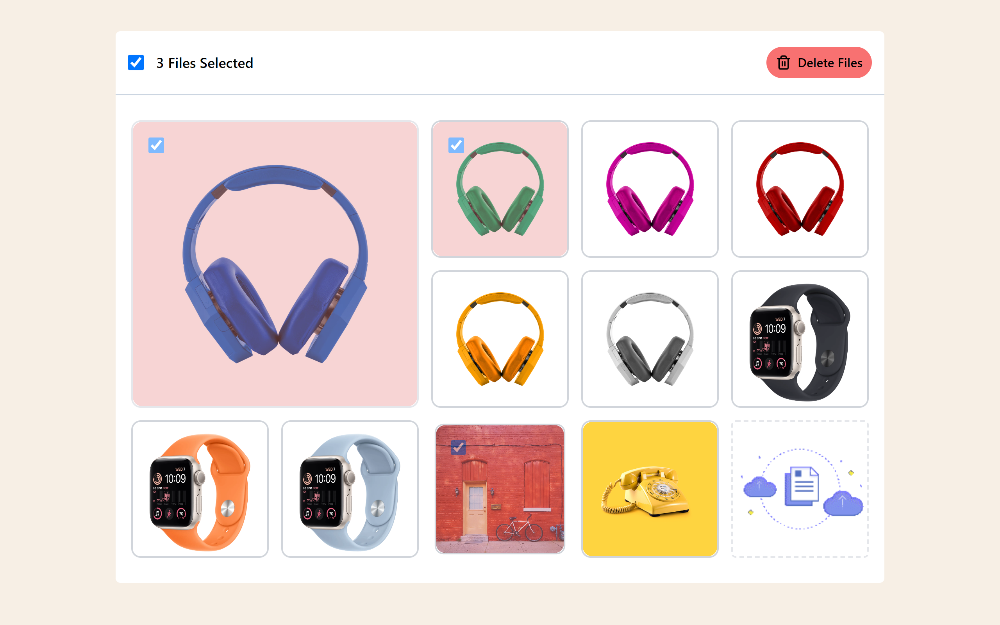
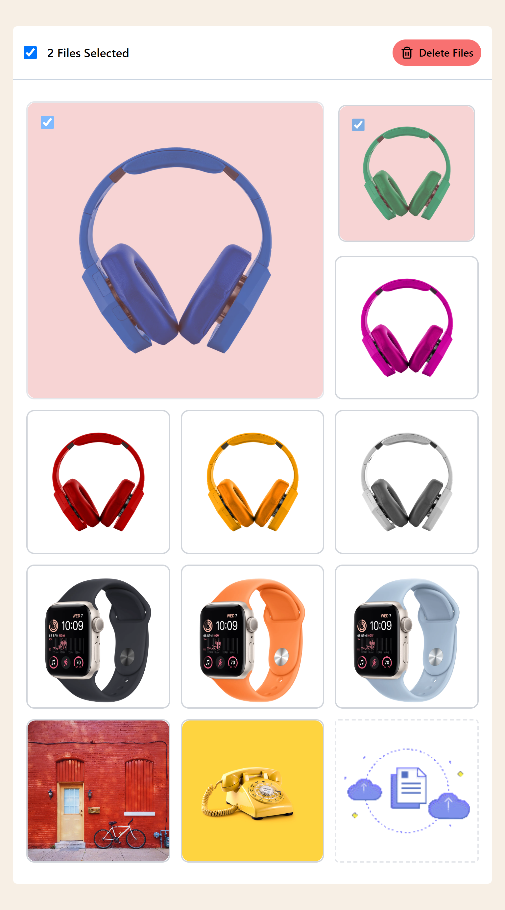
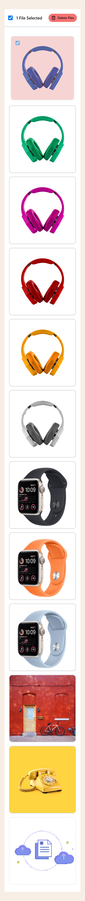

# React JS Image Gallery

Users may see and interact with an image gallery with this React JS image gallery project. The gallery has a grid design, sorting, multiple image deletion, and a feature image setting option. With its transitions and animations, it offers a dynamic and seamless user experience.

## Live Link

To engage with the project's live demo, go to https://ollyo-task2023.netlify.app/

## Features

### Gallery Layout:

- The gallery uses a grid style to show the photographs.
- One image is highlighted and stands out more than the rest.

### Sorting:

- Drag-and-drop feature (Custom drag-and-drop Create no library Use) allows users to rearrange the photos.
- Pictures can be placed in the order that you want.

### Deleting:

- It's possible to choose and remove several photos.
- For clarity, selected photos are indicated graphically.

### User Experience:

- The user experience offered by the app is responsive and seamless.
- To improve the appearance and feel, transitions and animations are used.

## Include the Image Upload feature as well.

## Technology Use

- React js
- Tailwind Css

## Screenshots

